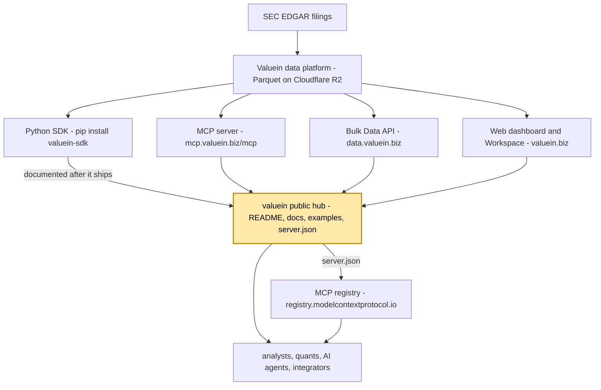
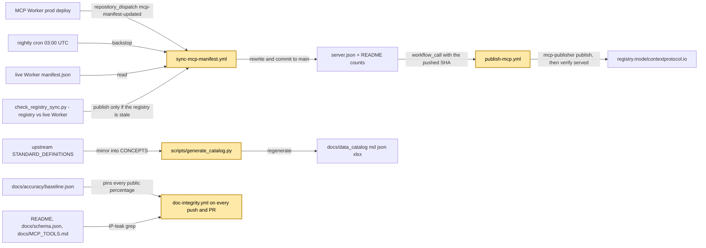

# valuein — architecture map

> One screen: what this repository is for, where it sits in the Valuein platform, how it works,
> and where things live. **Purpose, goals and guardrails mirror `CLAUDE.md`** — when one changes,
> change the other in the same PR. Volatile numbers live in the source they name, never here.

## Purpose

`github.com/valuein/valuein` is the public-facing docs, examples, and MCP-registry manifest for Valuein — the landing page a prospective user hits from PyPI, Smithery, or a Show HN post. Its readers are analysts, quants, AI agents and integrators learning what Valuein ships, plus the public MCP registry, which is fed from `server.json`. It contains no SDK, no MCP server, no pipeline and no tests — those live in sibling repos, and this hub only documents what they have already shipped.

## Goals

| Goal | How this repo delivers it | Where to verify |
|---|---|---|
| Be the front door: a reader gets from landing page to live data without a token | `README.md` quickstart; every example runs on the sample tier with no API key | `uv run python examples/python/getting_started.py` |
| Examples double as the smoke test for the published SDK | Standalone `examples/python/*.py` that `import valuein_sdk`, mirrored one-to-one by `examples/notebooks/` | `getting_started.py` runs clean on the sample tier → the SDK release is healthy |
| The public MCP registry advertises exactly the version production serves | `sync-mcp-manifest.yml` rewrites `server.json` from the live Worker manifest; `publish-mcp.yml` verifies the registry serves it | `uv run python scripts/check_registry_sync.py --check` |
| Public docs never leak proprietary signal names or inflate accuracy | `doc-integrity.yml` IP-leak gate + accuracy-drift gate on every push and PR | The workflow run; `docs/accuracy/baseline.json` |
| The data catalog mirrors the pipeline's canonical concept list | `scripts/generate_catalog.py` (`CONCEPTS`) writes `docs/data_catalog.{md,json}` + `DATA_CATALOG.xlsx` | `uv run python scripts/generate_catalog.py`, then diff `docs/` |
| Every example preserves PIT and survivorship discipline | `filing_date <= trade_date`, delisted entities kept, membership via `references.cik = index_membership.cik` | `CLAUDE.md` "Data primer"; `examples/python/pit_factor_dataset.py` |

## Where it sits

Only public surfaces are shown. One Stripe-issued Bearer token unlocks every channel at the user's tier; plan details are read live from `https://data.valuein.biz/v1/plans`, never copied here.

## How it works

- Registry publishing is fully automatic with no approval step: a prod deploy of the Worker dispatches to this repo, the bot rewrites `server.json` + README counts from the live manifest, commits, and republishes.
- The nightly publish is gated on the registry being stale (`check_registry_sync.py`), never on a repo diff — a diff gate stays green forever once one publish fails, because `server.json` is already correct.
- The sync commit uses `GITHUB_TOKEN`, so the `push` trigger on `publish-mcp.yml` never fires for it; the sync calls publish directly via `workflow_call`, passing the SHA it just pushed.
- `doc-integrity.yml` fails closed on any scrubbed signal name in the public files and on any `NN.NN%` that drifts from `docs/accuracy/baseline.json` beyond the gate's tolerance.

## Map of the code

| Path | What lives there | Change it when |
|---|---|---|
| `README.md` | Public landing page: quickstart, channels, plans, data model, recipes by role | A channel, plan or data-model fact changes upstream — tool counts are bot-written, never hand-edit them |
| `AGENTS.md` · `CONTRIBUTING.md` | Agent-facing and human-facing conventions (install snippet, `run_template` kwargs-only rule, pay-per-call rail) | The public API, default tiers, install commands or example conventions change — update both together |
| `docs/` | `METHODOLOGY.md`, `SLA.md`, `COMPLIANCE_AND_DDQ.md`, `MCP_TOOLS.md`, `QUERY_COOKBOOK.md`, `WORKSPACE_GUIDE.md`, `SDK_USE_CASES.md`, `AGENT_ECONOMY_RAIL.md`, `schema.json`, data catalog (md / json / xlsx) | The shipped product surface changes; `schema.json` is regenerated here LAST after an upstream schema change |
| `docs/accuracy/` | `baseline.json` (the measured accuracy figures), `identities.json`, `methodology.md`, `README.md` | Never by hand — `baseline.json` comes from a production run; re-derive it with `scripts/accuracy/accuracy_check.sql` |
| `docs/arelle_config/` | XBRL tooling configuration for Arelle (config, not code) | XBRL tooling setup changes |
| `examples/python/` | Standalone scripts that `import valuein_sdk`, one concept each, sample tier, no token | The SDK publishes a new public method or template — add an example that exercises it |
| `examples/notebooks/` | Jupyter mirrors of the Python scripts (Colab-ready) | The matching script changes — same PR |
| `scripts/generate_catalog.py` | Catalog generator; its inline `CONCEPTS` is the public source of truth for the concept list | A canonical concept is added or renamed upstream |
| `scripts/sync_mcp_manifest.py` · `scripts/check_registry_sync.py` | The bot's rewrite step, and the registry-vs-live-Worker drift check (`--check`: exit 1 drift, 2 indeterminate) | Diagnosing registry drift; the Worker manifest shape changes |
| `server.json` | MCP registry manifest: `io.github.valuein/mcp-sec-edgar` at `https://mcp.valuein.biz/mcp` | Never by hand — written by `sync-mcp-manifest.yml` |
| `.github/workflows/` · `.github/ISSUE_TEMPLATE/` | The three workflows below; issue forms for data-quality report, feature request, outage, question | A gate or the publishing flow changes; support intake changes |

## Runs on its own

| Workflow | Trigger | What it does |
|---|---|---|
| Doc integrity (`doc-integrity.yml`) | every `push` and `pull_request`; `workflow_dispatch` | IP-leak gate (greps `docs/schema.json`, `README.md`, `docs/MCP_TOOLS.md` for scrubbed signal names) + accuracy-drift gate against `docs/accuracy/baseline.json` |
| Sync MCP manifest (`sync-mcp-manifest.yml`) | `repository_dispatch` `mcp-manifest-updated` from a Worker prod deploy; cron 03:00 UTC nightly (backstop); `workflow_dispatch` | Rewrites `server.json` + README counts from the live Worker manifest, commits to `main`, calls the publish workflow when the registry is stale |
| Publish to MCP Registry (`publish-mcp.yml`) | `workflow_call` from the sync (normal path); `push` to `main` touching `server.json` (human fallback); `workflow_dispatch` | Installs `mcp-publisher`, logs in via OIDC, publishes `server.json`, then verifies the registry serves that version; runs are serialised because registry versions are immutable |

All three are runnable by hand via `workflow_dispatch`.

## Guardrails

- This repo is always updated LAST — it documents what already shipped, and updating it ahead of a sibling is a silent lie to the public.
- Never bump or hand-edit `server.json`, and never gate its publish on a review: the bot writes version and counts from the live Worker manifest, and a hand edit races it on an immutable registry version.
- Never reintroduce a scrubbed proprietary signal name in `docs/schema.json`, `README.md` or `docs/MCP_TOOLS.md` — the IP-leak gate fails the build.
- Never hardcode an accuracy percentage that is not taken from the current `docs/accuracy/baseline.json` — the accuracy-drift gate fails the build.
- No source code, no tests, no `pyproject.toml` here — SDK, MCP, pipeline and infrastructure changes go to the sibling repos first, then propagate here.
- Examples: `snake_case.py`, under 150 lines, one concept per file, standalone on the sample tier, no hardcoded API keys, bucket names or internal URLs; the notebook mirrors the script in the same PR.
- No CUSIPs anywhere (licensing risk) — use FIGI and LEI; `concept_mapping` is internal and never shown.
- Always `uv run python …`, never bare `python`; run `ruff` check + format on `examples/` and `scripts/` before a PR.

## Fragile edges

| If you change this here | It breaks this elsewhere |
|---|---|
| `server.json` by hand (version or counts) | The registry publish — versions are immutable, so whichever publish loses the race fails on an already-published version, and the registry can end up advertising a version nobody serves |
| `CONCEPTS` in `scripts/generate_catalog.py` without the matching upstream `STANDARD_DEFINITIONS` change (or the reverse) | `docs/data_catalog.{md,json}` and `DATA_CATALOG.xlsx` describe concepts that `fact.standard_concept` does not carry |
| Any `NN.NN%` in `README.md` or `docs/accuracy/*` | `doc-integrity.yml` — the figure must come from `docs/accuracy/baseline.json`, which is regenerated from a production run outside this repo |
| `docs/schema.json` (path or contents) | The published URL agents fetch (`…/raw/main/docs/schema.json`); the SDK and MCP read the live R2 manifest at runtime, so a stale copy here misleads readers, not code |
| An example's SDK calling convention (`run_template` kwargs-only, `run_query`) | Nothing here tests it — the SDK's own suite pins the convention, and a broken example is a broken smoke test for every new user |
| What `scripts/sync_mcp_manifest.py` expects of the Worker's `manifest.json` | The nightly and dispatched sync — a missed dispatch is covered by the cron, a changed manifest shape is not |

## Read next

- `CLAUDE.md` — working rules for agents and humans
- `README.md` — the public landing page: quickstart, channels, plans, data model, recipes by role
- `AGENTS.md` — the agent-facing analogue of `CONTRIBUTING.md`: canonical install snippet, MCP endpoint, pay-per-call rail, authoritative URLs
- `CONTRIBUTING.md` — rules for contributing an example or notebook
- `docs/accuracy/README.md` — the measured accuracy proof and how to re-derive it with DuckDB
